# bamazon commerce application
Node.js & MySQL Amazon-like storefront with the MySQL

## Technologies Used
- node.js
- mySQL
- inquirer.js and mysql npm packages

## Application functions
Bamazon is a command line commerce interface with two modules, one for customers and one for managers.
The customer module allows a client to make a purchase and the manager module allows viewing and manipulation of inventory.

### Customer module implementation and functionality
When the customer loads the bamazonCustomer.js module in the CLI, they are presented with the following screen:

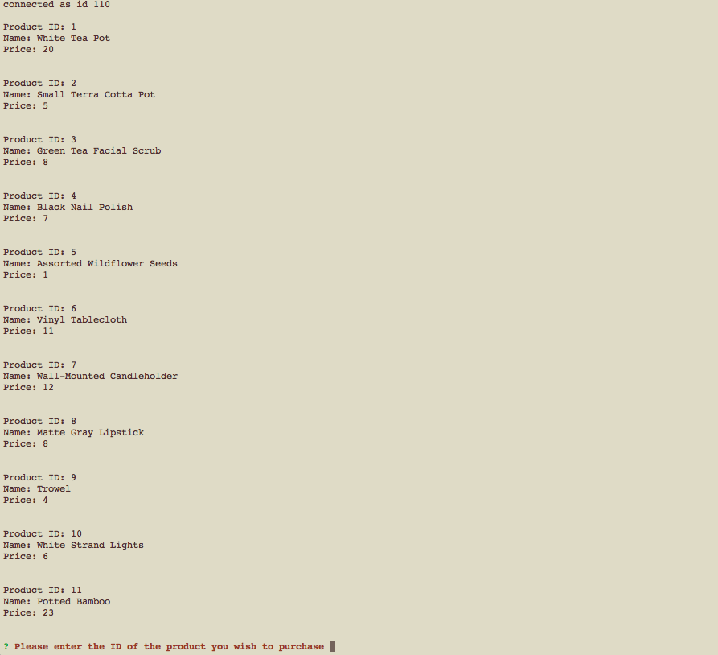

The customer may then make a purchase.

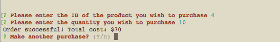

At this point the mySQL products table is updated to reflect a decrease in inventory and an increase in product sales.
Before:

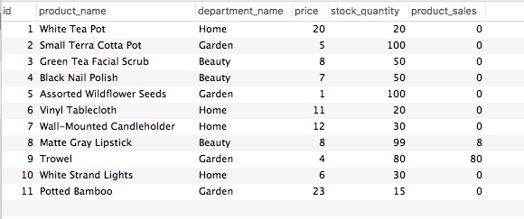

After:
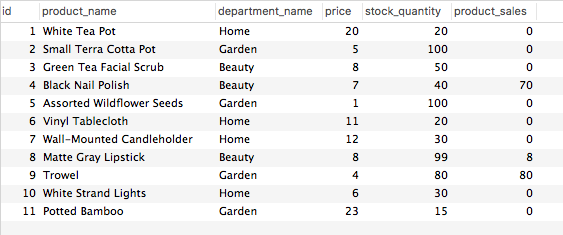

The logic for the customer application uses inquirer.js to create the prompts and uses promises and the mysql npm package
to send an update query to the server.
Pictured here is the logic pertaining to manipulating the server.

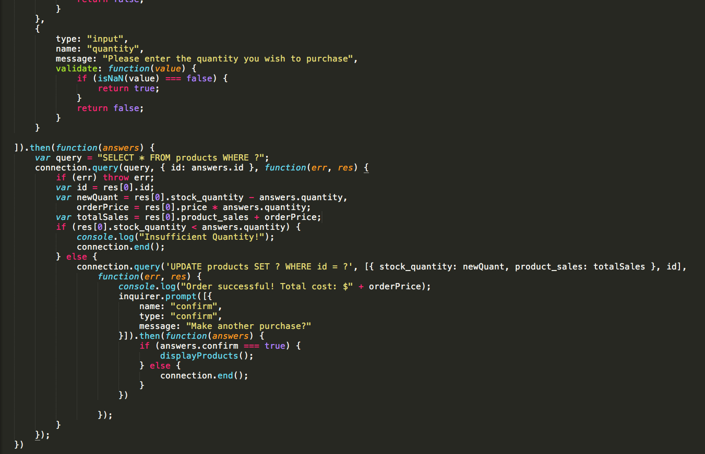

### Manager module implementation and functionality
When the manager loads the bamazonManager.js module in the CLI, they are presented with the following screen,
generated by inquire.js:

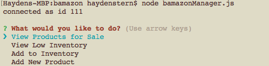

#### If the manager selects the first option, they can view all product information.

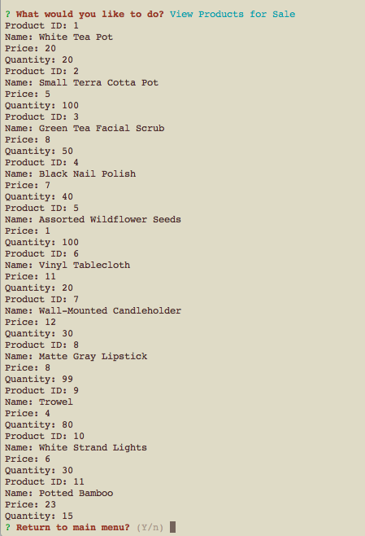.

#### If the manager selects the second option, they can view any items with low inventory.

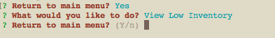

In this case, there was no low inventory to view. This is the logic associated with viewing low inventory:

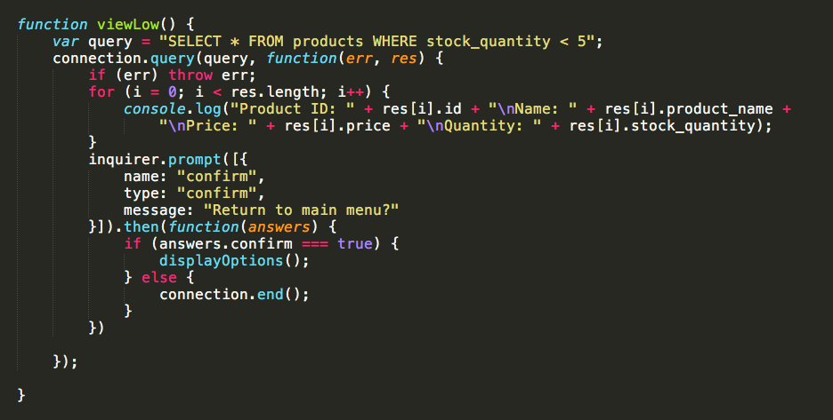

#### The manager can restock inventory using the third option:

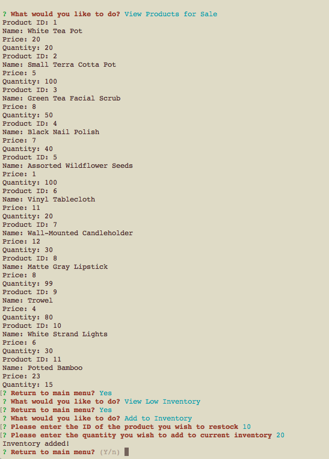

which updates the mySQL products table:

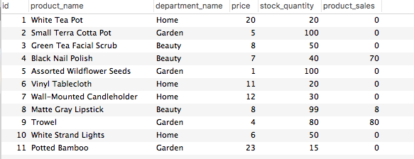

#### And add a new product using the fourth:

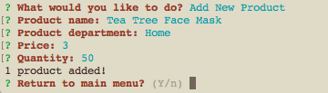

which adds that product to the database:

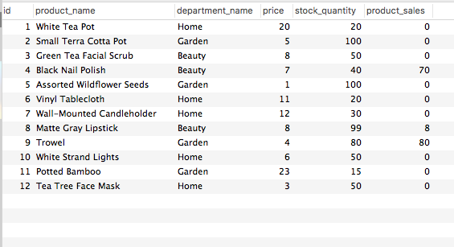

# bamazon
